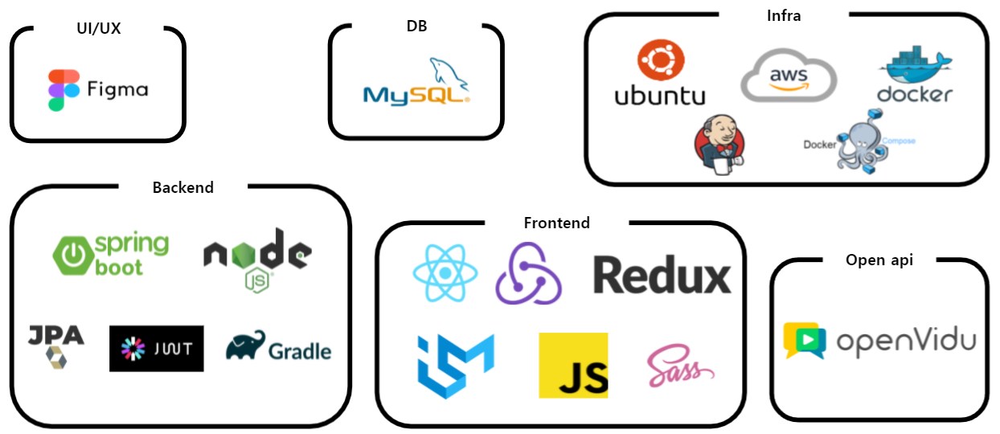
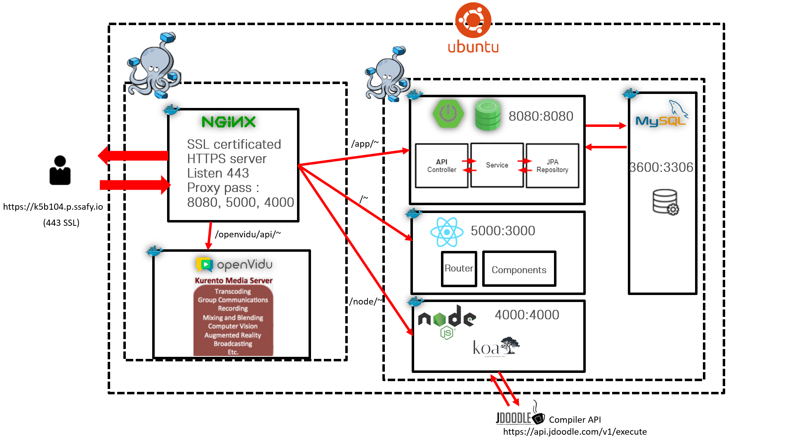

# Cohort

> 코딩 초보들을 위한 알고리즘 스터디 플랫폼

알고리즘 공부를 하고 싶은 데 어려움이 많은 SSAFY생들과 취업준비생들을 위해 알고리즘 스터디 환경을 제공함으로써, 서로 배움을 베풀고 코드 리뷰할 수 있는 플랫폼을 만들었습니다.

🎞 **Youtube 영상**

## ✏ 기술 스택

## ✏아키텍처

### 1) Application Architecture

### 2) Server Architecture

## ✏Cohort 주요 기능 소개

### 1) Main Page

- 온보딩 방식 채택
  - 우리 알고리즘 플랫폼의 존재 이유
  - 알고리즘 사이트 목록
  - 고객 지원

### 2) Study room

- 코드 동시 작성 및 수정
- Python, Java, C++, C의 4가지 언어 컴파일러 가능
- 입·출력 가능
- 채팅 기능
- 해당 코드 게시판 저장 기능

### 3) Post (게시판)

- Python, Java, C++, C의 4가지 언어 컴파일러 가능
- 입·출력
- 다양한 플랫폼 게시판에 저장
- 좋아요, 댓글 기능
- 베스트 게시글

## ✏팀원 역할

|  이름  | 팀장/팀원 |     역할      |
| :----: | :-------: | :-----------: |
| 송한샘 |   팀장    |    Backend    |
| 오수형 |   팀원    | Backend&CI/CD |
| 한상정 |   팀원    |   Frontend    |
| 한훈희 |   팀원    |   Frontend    |

